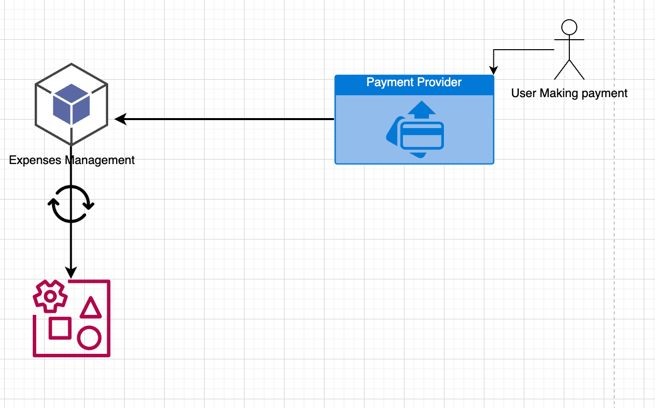

## Expense management platform 

#### Task breakdown
1. Validate al the incoming request -  middleware
2. Implementing an endpoint to subscribe to the payment solutions provider transactions web-hook: 4 - 6 hours
3. Implementing an API-based transaction synchronization to the accounting systems: 8 - 10 hours
    * Implement an API client to connect to the accounting system API.
4. Test the integration with a sandbox account make sure records are created correctly

